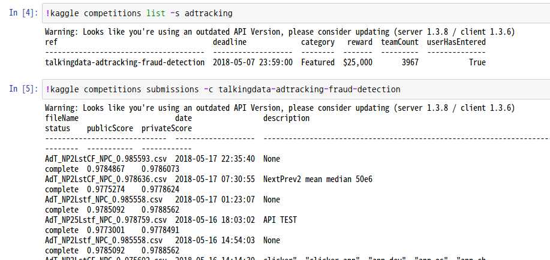

# Installation
[Kaggle API GitHub](https://github.com/Kaggle/kaggle-api)
```
pip install Kaggle
```
<br>
# API credentials
```
kaggle --version
Unauthorized: you must download an API key from https://www.kaggle.com/<username>/account
Then put kaggle.json in the folder /home/jeon/.kaggle
```
Download json file on Kaggle Account Pages API  
And move json file to Kaggle Path  

```
pip show Kaggle
```

<br>
# LookUP

```
kaggle --help
```
* **competitions** : *Commands related to Kaggle competitions*
* **datasets**: *Commands related to Kaggle datasets*
* **config** : *Configuration settings*

```
kaggle competitions --help
kaggle datasets --help
kaggle config --help
```

help 옵션으로 필요 명령을 직관적으로 확인 가능하다.  

```
kaggel competitions --help

  list
  files
  download
  submit
  submissions
```


Submissions 파일 다운로드는 api로는 아직 지원하지 않는 듯 하다.  

API 사용의 장점은 웹을 통하지 않고,   
데이터셋 다운로드 및 submission 제출이 있겠지만...   
api를 사용한다고 속도가 빠르지는 않다.  
웹인터페이스를 이용하는 중간 과정을 생략하는 정도인 듯 하다.   

<br>


# Jupyter Notebook




위 이미지처럼 활용가능  


데이터셋 다운로드 및 서브미션 제출도 가능하다.  

<br>

# Google Colab with Kaggle api
```
!pip install kaggle
```
api json 파일 구글 드라이브 업로드 후   

```
from googleapiclient.discovery import build
import io, os
from googleapiclient.http import MediaIoBaseDownload
from google.colab import auth

auth.authenticate_user()

drive_service = build('drive', 'v3')
results = drive_service.files().list(
        q="name = 'kaggle.json'", fields="files(id)").execute()
kaggle_api_key = results.get('files', [])

filename = "/content/.kaggle/kaggle.json"
os.makedirs(os.path.dirname(filename), exist_ok=True)

request = drive_service.files().get_media(fileId=kaggle_api_key[0]['id'])
fh = io.FileIO(filename, 'wb')
downloader = MediaIoBaseDownload(fh, request)
done = False
while done is False:
    status, done = downloader.next_chunk()
    print("Download %d%%." % int(status.progress() * 100))
os.chmod(filename, 600)
```
```
!kaggle competitions list -s adtracking
```

사용 여부 확인된다.   
